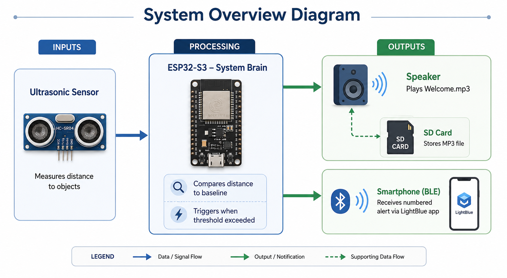
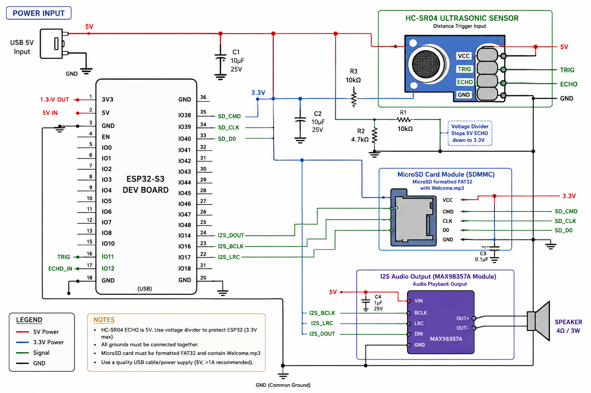

# CS Commons Door Sensor
## A smart entry detection system

**Original sensor and audio system:** Arvin Shirchindorj, Ali Abbaka  
**BLE notification system:** Patrick Mulikuza  
Whitman College — Spring 2025
CS 210 Computer Systems Fundementals
**Instructor:** Dr. William Bares 

---

## a) What Is This and Why Does It Matter?

This system is an autonomous door entry monitoring mechanism. It 
detects when someone opens a door, produces an audio welcome 
message, and notifies the room administrators about the entrance.
This system presents multiple benefits and potential usage across 
multiple fields. First, it's a potential security system that 
allows one to remotely track and investigate the traffic in a room
(we plan to include a camera that's triggered as soon as someone 
enters the room in future iterations). This can be a particularly 
cheap entrance tracking system for people with disabilities, for 
example. Or it could be used to monitor rooms remotely after 
open hours. It could also be used in hotel-like environments, less 
for security purposes, but just to keep track of entries remotely at 
different entrances.


For the notification method, at first, we tried Wi-Fi-based
systems. We unsuccessfully attempted to use the Telegram Bot API.
The ESP32 connected to campus WiFi successfully,
but Whitman's network firewall blocks HTTP requests from
unregistered embedded devices, so the API calls never reached Telegram's
servers. We tried ntfy. Next, it encountered the same issue. The solution was to skip
the network entirely and use Bluetooth. Bluetooth Low Energy (BLE) lets the ESP32 connect
directly to a phone over radio without going through any router or
firewall.

---

## b) System Overview

The diagram below shows how the three parts of the system connect.
The ESP32-S3 is the brain in the middle — it reads from the sensor,
decides whether someone entered the room or not, and sends output to both the
speaker and the phone simultaneously.


*Overview of the three main components and how data flows between them.*


**Inputs:**
- Ultrasonic sensor — measures the distance to whatever is in front of it by sending
  a sound signal, detecting the echo signal, and deriving the distance traveled.

**Processor:**
- ESP32-S3 — compares each reading to the calibrated baseline and triggers
  when the change exceeds the threshold -- the estimated distance of the door.

**Outputs:**
- Speaker — plays Welcome.mp3 from the SD card. (In our project,
we had a hard time with the sound. It's hard to hear the welcome message.
We tried increasing the volume using the code, but we reached the maximum 
capacity of the speaker and the sound was even less audible.)
- Phone via BLE — receives a numbered alert through the LightBlue app

The SD card stores the MP3 file that
gets decoded and played when entry is detected.

---

## c) What You Need

### Hardware

| Component | Quantity | Notes |
|---|---|---|
| ESP32-S3 Development Board | 1 | Any ESP32-S3 variant |
| HC-SR04 Ultrasonic Sensor | 1 | 5V powered |
| MicroSD Card Module | 1 | SDMMC interface |
| MicroSD Card (8GB or less) | 1 | Must be FAT32 formatted |
| Small 8Ω Speaker | 1 | Connected via I2S on GPIO 14 |
| Jumper Wires | ~20 | Different colors to ease troubleshooting process |
| Breadboard | 1 |   |
| USB-C Data Cable | 1 | Must carry data — charge-only won't work |

### Software and Libraries

| Dependency | How to Install |
|---|---|
| Arduino IDE 2.x | Download at [arduino.cc/en/software](https://arduino.cc/en/software) |
| ESP32 board package by Espressif | File → Preferences → paste Espressif URL → Boards Manager → search "esp32" |
| ESP8266Audio library | Sketch → Include Library → Manage Libraries → search "ESP8266Audio" |
| ESP32 BLE Arduino | Included automatically with the ESP32 board package |
| LightBlue app (phone) | Free on iOS and Android |

### Audio File

Place an MP3 file named exactly `Welcome.mp3` in the **root folder**
of your microSD card. The filename is case-sensitive. It must not be
inside any subfolder, or you would have to modify the code accordingly.

---

## d) Wiring the Breadboard

Wire one component at a time. After each one, open the Serial Monitor
at 115200 baud and verify you see the expected output before adding
the next. This makes troubleshooting much faster.


*The fully wired breadboard. Detailed circuit diagram.*


Each table below tells you which wire goes where. You are connecting
two devices together — a sensor or module on one side, and the ESP32
board on the other. 

- **Left column** — the pin name printed on (or next to) the component you are wiring
- **Right column** — the GPIO pin number on your ESP32 board where that wire plugs in
- **GPIO** stands for General Purpose Input/Output — these are the numbered holes along the edges of your ESP32 board
- **VCC** means power — connect this to the voltage listed (either 3.3V or 5V on your ESP32)
- **GND** means ground — connect this to any pin labeled GND on your ESP32

> **Tip:** Wire one component at a time. After each one, open the
> Serial Monitor at 115200 baud and confirm the startup messages look
> correct before adding the next component. This makes troubleshooting
> a lot easier.

---

### Ultrasonic Sensor (HC-SR04)

This sensor measures distance by sending out a sound pulse and
listening for the echo. TRIG tells it when to send the pulse. ECHO
reports back how long the round trip took.

| Sensor Pin | ESP32 Pin | What it does |
|---|---|---|
| VCC | 5V | Powers the sensor |
| GND | GND | Completes the circuit |
| TRIG | GPIO 11 | ESP32 sends a pulse here to trigger a reading |
| ECHO | GPIO 12 | Sensor sends the echo timing back to ESP32 here |

---

### SD Card Module

The SD card stores the `Welcome.mp3` audio file. The ESP32 reads it
over a communication protocol called SDMMC, which requires three data
pins plus power and ground.

| SD Module Pin | ESP32 Pin | What it does |
|---|---|---|
| VCC | 3.3V | Powers the SD card module |
| GND | GND | Completes the circuit |
| CMD | GPIO 38 | ESP32 sends commands to the SD card here |
| CLK | GPIO 39 | Clock signal that keeps both sides in sync |
| D0 | GPIO 40 | Data travels between ESP32 and SD card on this line |

---

### Speaker (I2S Audio Output)

The speaker receives audio through a digital protocol called I2S,
which uses three signal lines. The ESP32 sends the audio data digitally, 
and the speaker converts it to sound.

| Speaker / Amplifier Pin | ESP32 Pin | What it does |
|---|---|---|
| BCLK | GPIO 16 | Bit clock — sets the speed of the audio signal |
| LRC | GPIO 17 | Left/Right clock — tells the speaker which audio channel is coming |
| DOUT (Audio Data) | GPIO 14 | The actual audio signal travels on this wire |
| GND | GND | Completes the circuit |

> **Note on BLC and CLK pins**
> The ESP32's default I2S pins are GPIO 12 and 13 — but GPIO 12 is
> already in use by our ultrasonic sensor's ECHO. We moved the I2S clock lines to
> GPIO 16 and 17.

---


*The fully wired breadboard. Cross-reference these photos with the
tables above if you are unsure where a wire belongs.*


---

## e) The Code

The full source file is linked in the next section. Here are the main design decisions behind it.


### 1. Sensor averaging to reduce false triggers

The HC-SR04 ultrasound sensor is hypersensitive to shifts in the environment. 
Factors such as air movement, electrical noise, and sound reflections can all
produce wrong readings. `getAverageDistance()` takes multiple readings per cycle and returns
the average, which filters out most of the outliers.

While testing the system, we also had to increase the movement threshold from 
20cm to 40cm, since the system kept flagging entry in the room when no one stood in front of the door.
This is worth bearing in mind in case you encounter the same issue. You can play around with the movement 
threshold and settle for the most reasonable choice.

### 2. Timing with `millis()` instead of `delay()`

The loop checks the sensor every 300 milliseconds. At first, we tried using `delay(300)`
 but it completely froze the
processor, and paused the audio mid-playback.

We switched to `millis()`, which returns how many milliseconds have passed since the board
turned on. By comparing `millis() - lastCheck >= 300`, the processor
keeps running `handleAudio()` during the wait rather than freezing.


### 3. Sending notifications with BLE 

The Bluetooth notification system lets someone monitor the room
remotely without requiring any network connection. When movement is
detected, `sendAlert()` pushes a numbered message to any connected
phone.

```c
void sendAlert(String reason) {
  if (!deviceConnected) return;
  ...
}
```

If no phone is connected, the function exits immediately. This lets the audio
still play, keeping the system from crashing just
because one forgot to connect to the BLE.


*A numbered alert arriving on the phone through LightBlue when someone enters the room.*


---

## f) Download the Source Code

The full source code, wiring documentation, and stage-by-stage
development history are on GitHub:

**[View the repository on GitHub](https://github.com//Patrick948-stack/cs-commons-door-sensor)**

The `firmware/` folder contains a separate subfolder for each
development stage so you can see exactly what was added at each step, and follow the project development process.

---

## g) References and Credits

- Kolban, N. (2017). *BLE_notify.ino*. ESP32 BLE Arduino Library.
  [github.com/nkolban/ESP32_BLE_Arduino](https://github.com/nkolban/ESP32_BLE_Arduino)
  — basis for the BLE server setup and notify characteristic

- Programming Electronics Academy. *Making A BLE Server With Your ESP32.*
  Open Hardware Design Group LLC.
  — guided the PROPERTY_NOTIFY and BLE2902 descriptor setup

- Philhower, E. *ESP8266Audio Library.*
  [github.com/earlephilhower/ESP8266Audio](https://github.com/earlephilhower/ESP8266Audio)
  — MP3 decoding and I2S audio output on ESP32

- Espressif Systems. *ESP32 Arduino Core Documentation.*
  [docs.espressif.com](https://docs.espressif.com/projects/arduino-esp32)
  — SDMMC interface, pin configuration, BLE libraries
- System overview diagram of an ESP32-S3-based embedded system showing ultrasonic sensing input,
  processing logic, and dual outputs (audio via speaker and BLE notification to smartphone).
  Generated using ChatGPT (OpenAI), 2026.

- *ESP32-S3-based doorway detection and audio playback system schematic. Includes HC-SR04 ultrasonic sensor,
  SDMMC microSD storage, and I2S audio output via MAX98357A. Generated with assistance from ChatGPT (OpenAI).*


- Original sensor and audio system by Arvin Shirchindorj and Ali Abbaka,
- BLE addition and GitHub setup by Patrick Mulikuza
  CS210 Computer Systems Fundementals
  Instructor: William Bares
  Whitman College, Spring 2025.

---

*CS Commons Door Sensor — Whitman College, Spring 2025*
